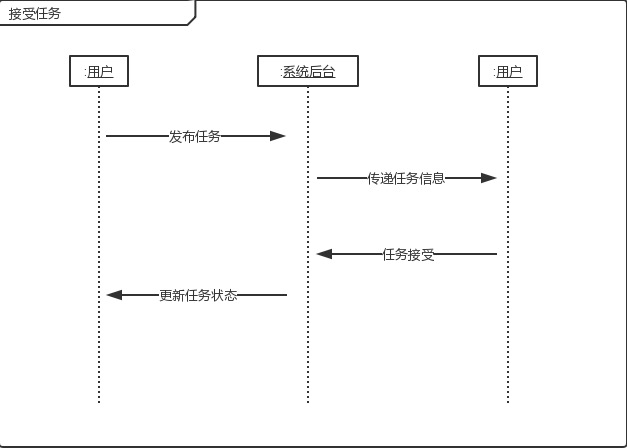
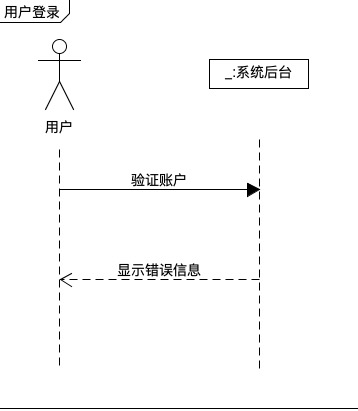
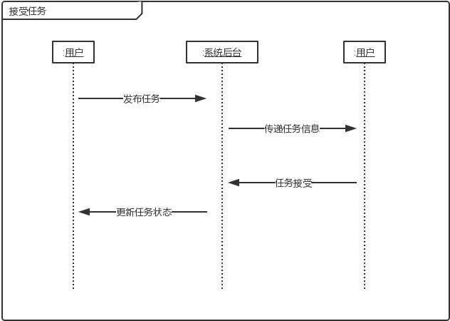

# System Sequence Diagram （功能模型）

根据我们的[用例分析](https://github.com/make-money-sysu/Dashboard/blob/master/文档内容/image/usecase.png)

## 基本功能

1. 用户登录
2. 发布问卷
3. 收发快递

## 系统顺序图

### 1. 用户登录

用户进入登录界面登录

### 2. 发布问卷

用户进入发布问卷界面

### 3. 收发快递

用户收发快递

