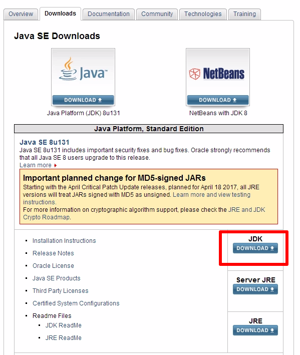
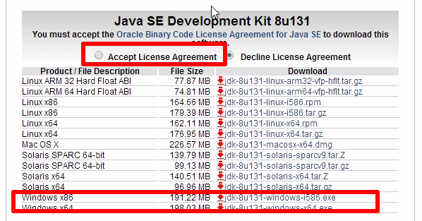
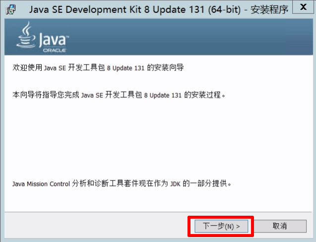
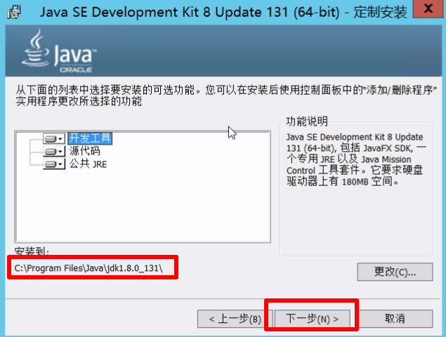
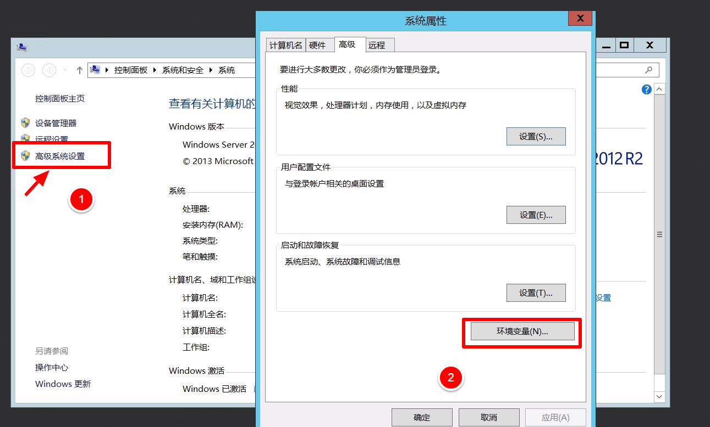
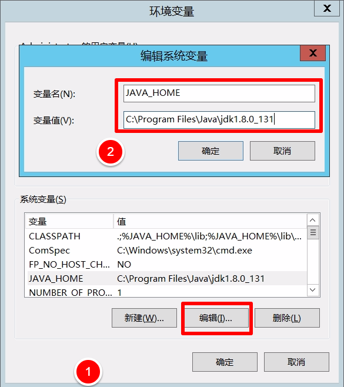
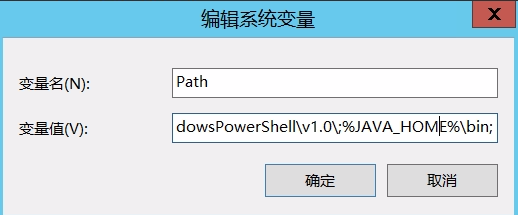
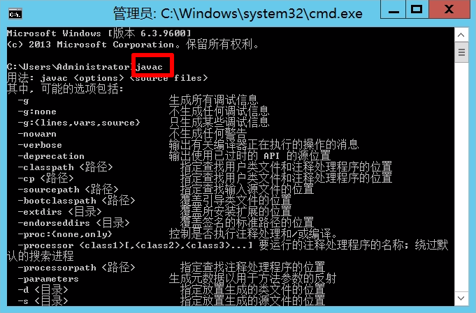
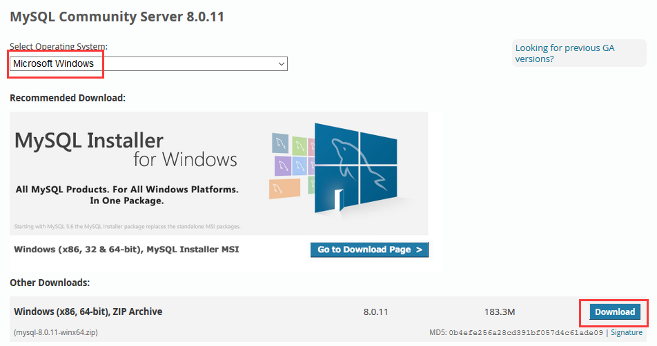

## 一、Java环境配置

**JDK下载**

官网:http://www.oracle.com/technetwork/java/javase/downloads/

进入官网后下载界面如下:

 

点击JDK Download进入详细下载页如下:把Accepet License Agreement勾上,系统是32位的就选windowsx86.系统64为的两个都可选择，建议选windowsx61的。



下载之后，就是傻瓜式的安装了，一直下一步。

 


记住你下面的安装路径，后面配置环境变量会用到。

  

 

**配置环境变量**

为了方便java程序的开发，需要配置一下环境变量，右击我的电脑->属性->高级->环境变量->用户变量中单击[新建(N)]添加以下环境变量

 

1. 配置JAVA_HOME

新建JAVA_HOME

变量名 `JAVA_HOME`

变量值 `C:\Program Files\Java\jdk1.8.0_131` (你的jdk安装路径)

              

2. 配置PATH                              

变量名 `Path`

变量值 `%JAVA_HOME%\bin;`

    

3. 配置CLASSPATH                         

变量名 `CLASSPATH`

变量值 `.;%JAVA_HOME%\lib\dt.jar;%JAVA_HOME%\lib\tools.jar;`

   

 4. 测试是否配置成功

window+R打开cmd窗口 输入javac出现如下说明配置成功

   

就这样java环境就搭建好了。


## 二、MySQL数据库部署

**安装MySQL数据库**
1. 在[MySQL官网下载页面](https://dev.mysql.com/downloads/mysql/)下载最新版的 Windows 版本的 MySQL 安装包。


2. 下载完后，我们将 zip 包解压到相应的目录

3. 在"%MySQL_PATH%\bin"下建立配置文件my.ini，配置以下基本信息：
```
[mysql]
# 设置mysql客户端默认字符集
default-character-set=utf8

[mysqld]
# 设置3306端口
port = 3306
# 设置mysql的安装目录
basedir=C:\Program Files\mysql-winx64
# 设置mysql数据库的数据的存放目录
datadir=C:\Program Files\mysql-winx64\data
# 允许最大连接数
max_connections=200
# 创建新表时将使用的默认存储引擎
default-storage-engine=INNODB
```

4. 接下来我们来启动下 MySQL 数据库：

以管理员身份打开 CMD 命令行工具，切换目录：

`cd %MySQL_PATH%\bin`

输入以下安装命令：

`mysqld install`

启动输入以下命令即可：

`net start mysql`

**创建数据库**

数据库代码如下：

```sql
/*
 Navicat MySQL Data Transfer
 Source Schema         : db_ktv
 Target Server Type    : MySQL
 Target Server Version : 50721
 File Encoding         : 65001
*/

SET NAMES utf8mb4;

SET FOREIGN_KEY_CHECKS = 0;

-- ----------------------------
-- Table structure for tb_food
-- ----------------------------
DROP TABLE IF EXISTS `tb_food`;
CREATE TABLE `tb_food`  (
  `id` int(11) NOT NULL AUTO_INCREMENT,
  `fname` varchar(20) CHARACTER SET utf8 COLLATE utf8_general_ci NOT NULL,
  `price` decimal(10, 2) NOT NULL,
  `stock` int(11) NOT NULL,
  PRIMARY KEY (`id`, `fname`) USING BTREE
) ENGINE = InnoDB AUTO_INCREMENT = 1 CHARACTER SET = utf8 COLLATE = utf8_general_ci ROW_FORMAT = Dynamic;

-- ----------------------------
-- Table structure for tb_manager
-- ----------------------------
DROP TABLE IF EXISTS `tb_manager`;
CREATE TABLE `tb_manager`  (
  `username` varchar(255) CHARACTER SET utf8 COLLATE utf8_general_ci NOT NULL,
  `password` varchar(255) CHARACTER SET utf8 COLLATE utf8_general_ci NOT NULL,
  PRIMARY KEY (`username`) USING BTREE
) ENGINE = InnoDB CHARACTER SET = utf8 COLLATE = utf8_general_ci ROW_FORMAT = Dynamic;

-- ----------------------------
-- Table structure for tb_order
-- ----------------------------
DROP TABLE IF EXISTS `tb_order`;
CREATE TABLE `tb_order`  (
  `id` int(11) NOT NULL AUTO_INCREMENT,
  `ordertime` datetime(0) DEFAULT NULL,
  `room` varchar(32) CHARACTER SET utf8 COLLATE utf8_general_ci NOT NULL,
  `cname` varchar(30) CHARACTER SET utf8 COLLATE utf8_general_ci NOT NULL,
  `phone` varchar(30) CHARACTER SET utf8 COLLATE utf8_general_ci NOT NULL,
  `price` int(11) DEFAULT NULL,
  `pay` int(11) DEFAULT 0,
  `detail` varchar(500) CHARACTER SET utf8 COLLATE utf8_general_ci DEFAULT NULL,
  PRIMARY KEY (`id`) USING BTREE,
  INDEX `fk_1`(`cname`) USING BTREE,
  INDEX `fk_2`(`phone`) USING BTREE,
  CONSTRAINT `fk_1` FOREIGN KEY (`cname`) REFERENCES `tb_vip` (`cname`) ON DELETE CASCADE ON UPDATE CASCADE,
  CONSTRAINT `fk_2` FOREIGN KEY (`phone`) REFERENCES `tb_vip` (`phone`) ON DELETE CASCADE ON UPDATE CASCADE
) ENGINE = InnoDB AUTO_INCREMENT = 1 CHARACTER SET = utf8 COLLATE = utf8_general_ci ROW_FORMAT = Dynamic;

-- ----------------------------
-- Table structure for tb_room
-- ----------------------------
DROP TABLE IF EXISTS `tb_room`;
CREATE TABLE `tb_room`  (
  `id` int(11) NOT NULL,
  `type` varchar(10) CHARACTER SET utf8 COLLATE utf8_general_ci NOT NULL,
  `price` double DEFAULT NULL,
  `status` int(11) NOT NULL DEFAULT 0,
  `start_time` datetime(0) DEFAULT NULL,
  `end_time` datetime(0) DEFAULT NULL,
  PRIMARY KEY (`type`, `id`) USING BTREE,
  INDEX `index`(`type`) USING BTREE
) ENGINE = InnoDB CHARACTER SET = utf8 COLLATE = utf8_general_ci ROW_FORMAT = Dynamic;

-- ----------------------------
-- Table structure for tb_vip
-- ----------------------------
DROP TABLE IF EXISTS `tb_vip`;
CREATE TABLE `tb_vip`  (
  `id` int(11) NOT NULL AUTO_INCREMENT,
  `cname` varchar(20) CHARACTER SET utf8 COLLATE utf8_general_ci NOT NULL,
  `phone` varchar(20) CHARACTER SET utf8 COLLATE utf8_general_ci NOT NULL,
  PRIMARY KEY (`id`, `cname`) USING BTREE,
  INDEX `cname`(`cname`) USING BTREE,
  INDEX `phone`(`phone`) USING BTREE
) ENGINE = InnoDB AUTO_INCREMENT = 1 CHARACTER SET = utf8 COLLATE = utf8_general_ci ROW_FORMAT = Dynamic;

SET FOREIGN_KEY_CHECKS = 1;
```

## 三、将系统部署到服务器
接下来要把系统部署到本地服务器上。我们所使用的服务器是Tomcat。

1. 下载项目文件中的"out/artifacts/SSM_KTV_SYSTEM_war_exploded"和"apache-tomcat-7.0.88"

2. 把"SSM_KTV_SYSTEM_war_exploded"复制到"apache-tomcat-7.0.88/webapps"下。

3. 启动Tomcat服务器。我们可以通过 http://localhost (_我们的服务器已经设置端口为80，为Web服务的默认端口，所以直接访问localhost不需要添加端口号_)来访问我们的系统。


