# 1. 引言
## 1.1 编写目的
本文档是ktv管理系统的，针对用户所进行的用户手册，目的是帮助用户正确地使用本系统，并提高工作效率。
根据现实需要，本系统分为商家端和客户端两大模块，并且分别给出了系统的安装，配置，使用的详细教程。
## 1.2 项目背景
1. 本软件系统的名称：ktv管理系统

2. 本软件系统开发商小组：Zero Group

3. 项目简介：本系统分为商家端和客户端两部分，商家端负责管理ktv管理系统，负责房间管理，会员管理
，账目管理等功能，也负责激活和结束客户端的服务状态，使用对象应为ktv工作人员。客户端应运行在各
个房间的主机上，当商家激活该房间时，客户可以在该系统上点餐和续订，并把订单汇总到商家端。

## 1.3 定义

管理员（商家）：ktv管理系统的管理者，拥有结算，增删房间，增删商品，查看并管理总体账目等权限，是本系统中的最高权限用户。

会员（客户）：ktv的消费者和使用者，在系统中购买服务，并且能查看自己的订单。
## 1.4 参考资料

# 2. 软件概述
## 2.1 目标
使用户能够轻松掌握本软件的安装及初步使用。
## 2.2 功能
管理员功能：

    a.管理员登陆：输入账户名，密码，由系统验证身份
    b.新增，删除房间，或更改已有房间的详细信息
    d.新增，删除商品，或更改已有商品的详细信息
    e.增加，删除会员，或更改已有会员的详细信息
    f.依据需求检索对应的房间，会员，商品。并获知其当前状态和详细信息。
    g.查询并管理账单账目。
    h.结账或下订单（即激活一个房间）
    
会员功能：

    a.续订房间
    b.购买商品
    c.查询当前购物车或提交订单

# 3. 运行环境
## 3.1 硬件

服务器要求：

处理器：1核1G（或以上）

带宽： 1Mbps（或以上）

硬盘：30GB（或以上）

客户机要求：

CPU: PentiumⅡ（或以上）
 
内存： 256M（或以上）
 
硬盘： 20G（或以上）
 
## 3.2 支持软件

操作系统：Windows7/8或更高版本。

浏览器：IE11.0或更高版本或者谷歌，火狐浏览器，各浏览器需支持HTML5。

数据库：mysql

服务器软件tomcat，Java1.8环境支持

# 4. 使用说明

## 4.1 安装和初始化

### 4.1.1服务器端部署

此步骤见《安装与部署说明》文档。

### 4.1.2客户端访问

客户端在机器上访问，管理员进入登陆验证页面，在房间内设备上直接进入会员访问界面即可。
此步骤详情见《安装与部署说明》文档。

## 4.2数据格式

1. 房间号码为0-100内的整数
2. 查询房间时：输入房间号可查询该房间，输入“空”可查询所有空房间，输入“空”加房间类型可
查询该类型的空房间   
3. 会员名字为2-12个字符   
4. 会员手机号码必须为11为并且要以13，15，18开头    
5. 查询会员时：输入会员名可以查询名字为该会员名的会员信息，输入电话号码可以
查询电话为该电话号码的会员信息 
6. 食物名称应该为字符串 
7. 食物单价应该为0-500间的整数 
8. 食物数量应为0-1000之间的整数 
9. 查询食物时：输入食物名称即可查询该食物的相关信息

## 4.4 出错和恢复

系统出现错误室，如没有重大错误，直接重启服务器即可

# 5. 运行说明

## 5.1 运行表
管理员运行表

运行情况| 运行目的
-------|----------
管理员登陆 | 供管理员在系统中进行操作
备忘录设置与更改 | 供管理员查看并修改备忘录信息 
房间管理 | 供管理员新增房间，查询房间
会员管理 | 供管理员新增会员，查询会员，更改会员信息
食物管理 | 供管理员新增食物，查询食物，管理食物信息
订单管理 | 供管理员管理，查询订单

会员运行表

运行情况|运行目的
-------|----------
普通会员登陆 | 在商家激活房间后会员可以进入系统进行点餐续订

## 5.2 运行步骤

### 5.2.1运行控制

管理员登陆：

在管理员登陆界面输入账户名和密码（初始账户名：admin 初始密码：1234），点记登陆，即可进入
管理员界面，管理员拥有
备忘录设置与更改，房间管理，会员管理，食物管理，订单管理等功能。

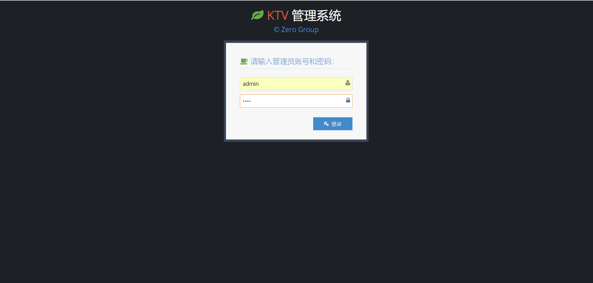

会员进入系统：
在房间的服务机上，若商家激活了该房间，用户即可在该房间查看当前自己的订单，购买食物，续订房间

### 5.2.2操作信息-商家端

#### 5.2.2.1 备忘录设置与更改
如下图为备忘录设置与更改，点记日历即可新增备忘录，
拖动备忘录边缘更改其有效期限，点记已有备忘录进行修改或者删除

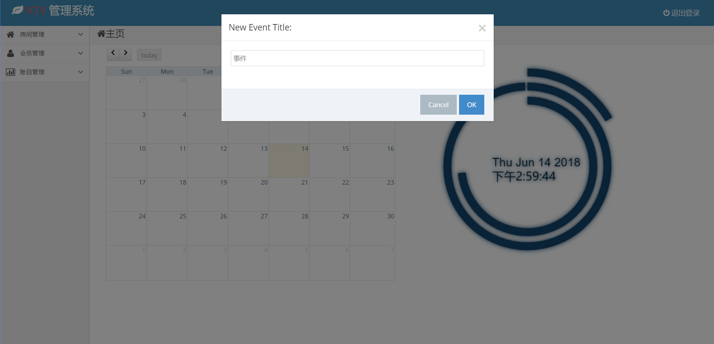

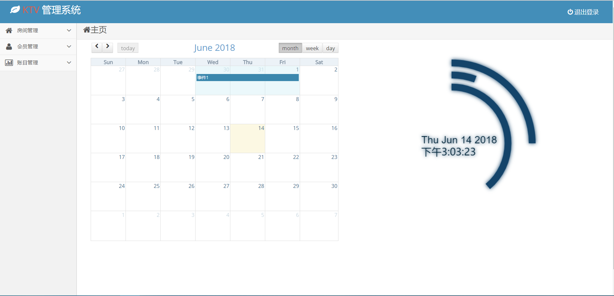
#### 5.2.2.2 房间管理
a.查看所有房间：进入房间管理界面后，选择左侧房间管理目录下的子目录"所有房间"，进入所有房间界面，
可以查看所有房间的基本信息，点击任意一个房间，可查看房间的详细信息

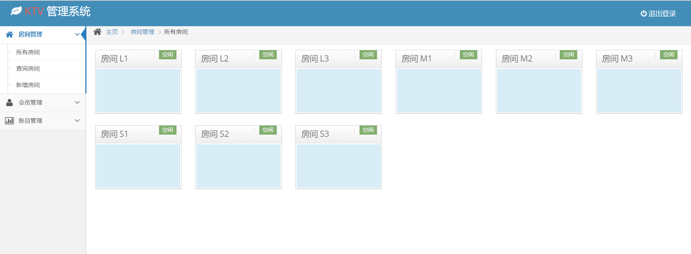

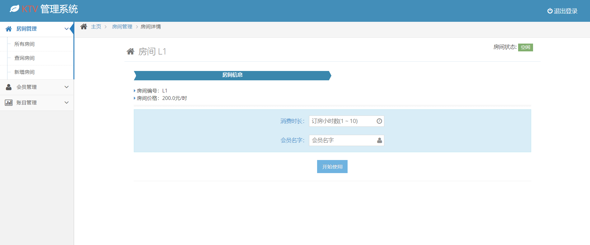

b.查询指定房间：进入房间管理界面后，选择左侧房间管理目录下的子目录"查询房间"，进入
查询房间界面，可以在输入框内输入查询条件，
输入房间号可查询该房间，输入“空”可查询所有空房间，输入“空”加房间类型可查询该类型的空房间
完成输入后点击查询，查询结果会显示在本页面上。

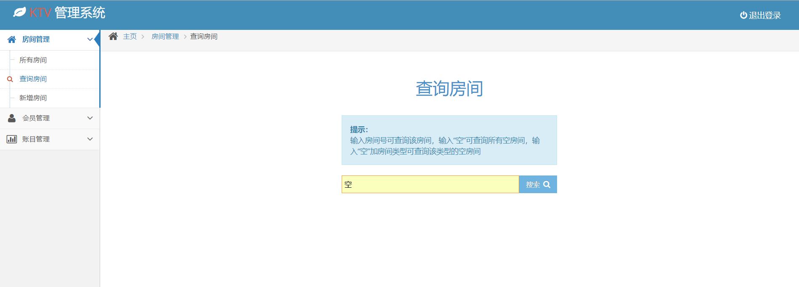

c.新增房间：进入房间管理界面后，选择左侧房间管理目录下的子目录"新增房间"，进入新增房间引导界面
，按照系统引导，输入房间类型，房间号码，
最后确认无误后点击创建即可完成房间新增。

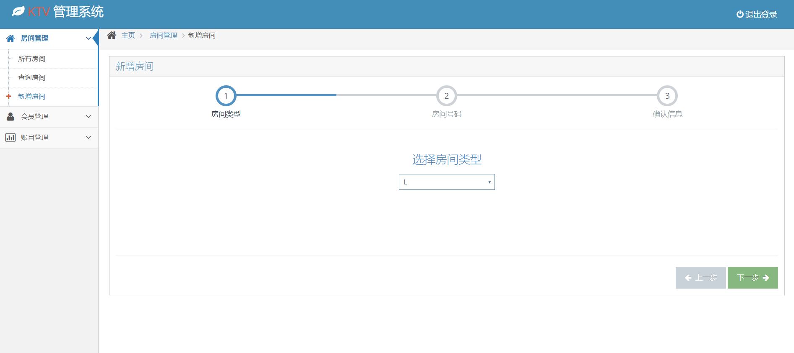

#### 5.2.2.3 会员管理
a.查询所有会员。进入会员管理界面后，选择左侧会员管理目录下的子目录"所有会员"，进入所有会员界面，
可以查看所有会员的信息，点击任意一个会员，可以查看对应会员的详细信息。

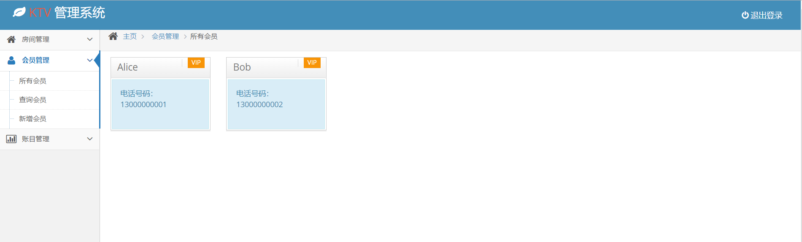

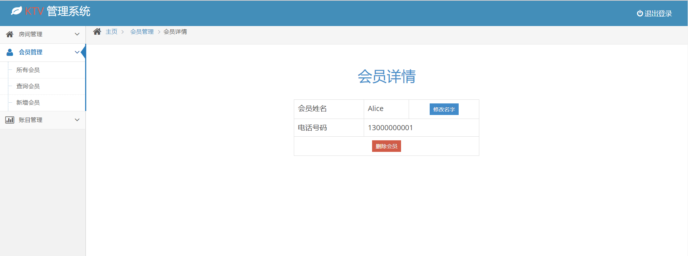

b.查询指定会员。进入会员管理界面后，选择左侧会员管理目录下的子目录"查询会员"，可在输入框内输入会员查询的
指定信息，输入会员名可以查询名字为该会员名的会员信息，输入电话号码可以查询电话为该电话号码的会员信息，
完成输入后点击查询按钮，查询结果会出现在本页面上。

c.新增会员。进入会员管理界面后，选择左侧会员管理目录下的子目录"新增会员"，进入新增会员引导界面，
按照系统引导，输入会员名字，会员电话，最后确认无误后点击确认，完成新增会员

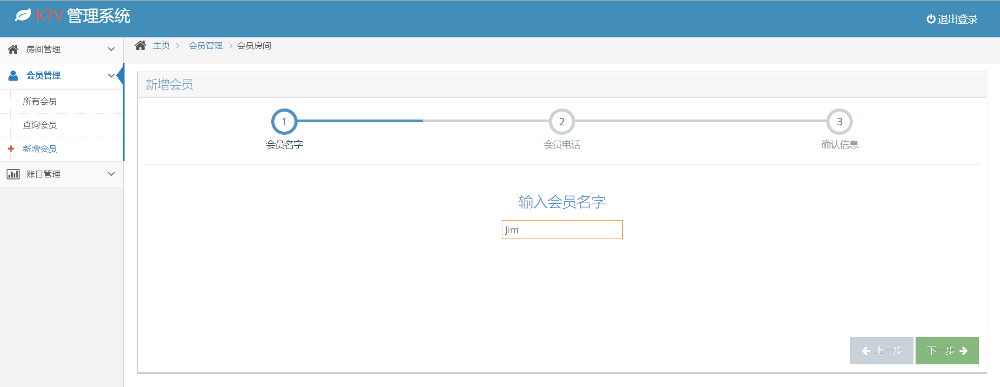

#### 5.2.2.4 食物管理
a.查询所有食物。进入账目管理-食物管理界面，选择左侧子目录下的"所有食物"，进入所有食物界面，
可以查看所有食物的信息，点击任意一个食物即可查询该食物的详细信息.

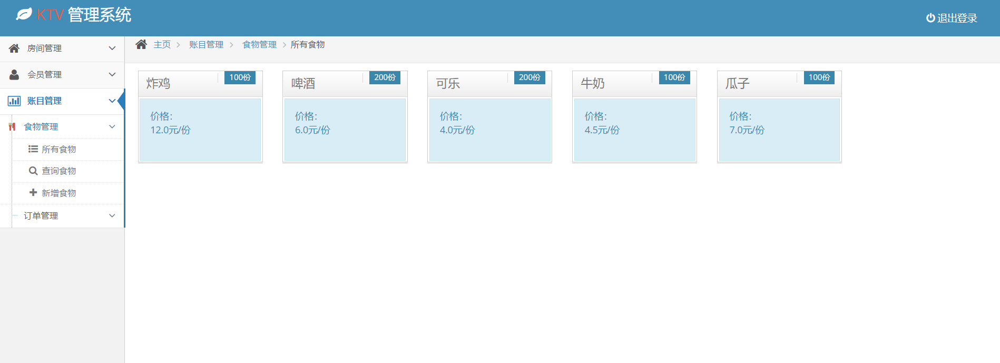

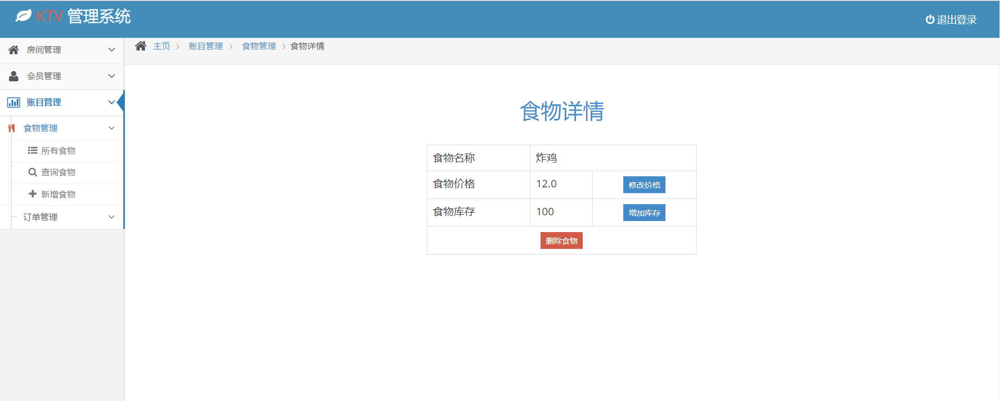

b.查询指定食物。进入账目管理-食物管理界面，选择左侧子目录下的"查询食物"，进入查询食物界面，可在输入框
内输入制定查询的信息，输入食物名称即可查询该食物的相关信息，完成输入后点击查询，查询结果会在
本页面内显示

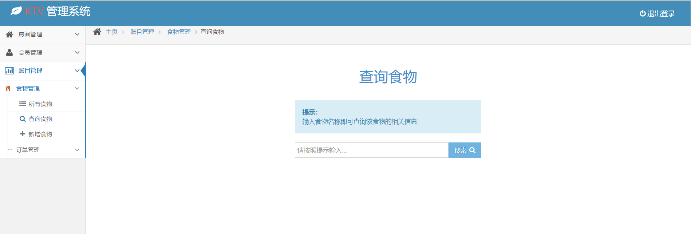

c.新增食物。进入账目管理-食物管理界面，选择左侧子目录下的"新增食物"，进入新增食物引导界面
按照系统引导，输入食物名称，食物价格，食物数量，最后确认无误后点击确认按钮.

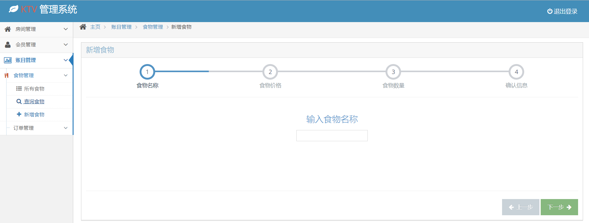

#### 5.2.2.5 订单管理

a.所有订单。进入账目管理-订单管理界面，选择左侧子目录下的"所有订单"，进入所有订单界面，
可查看所有订单信息，点击任意一个订单即可查询该订单的详细信息。

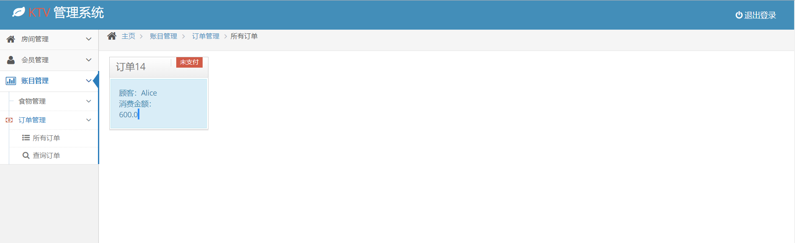

b.查询订单。进入账目管理-订单管理界面，选择左侧子目录下的"查询订单"，可在输入框内输入指定的
查询信息，输入会员名字即可查询该会员的所有订单信息，输入完成后点击确认按钮，查询结果会监视在
当前页面

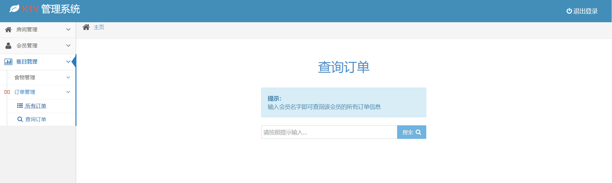

### 5.2.3操作信息-客户端

#### 5.2.3.1 购买食物
在用户界面上选择食物的数量，完成选择后点击右上角购物车标志，在检查订单无误后点击购买按钮
订单信息会传送到商家端

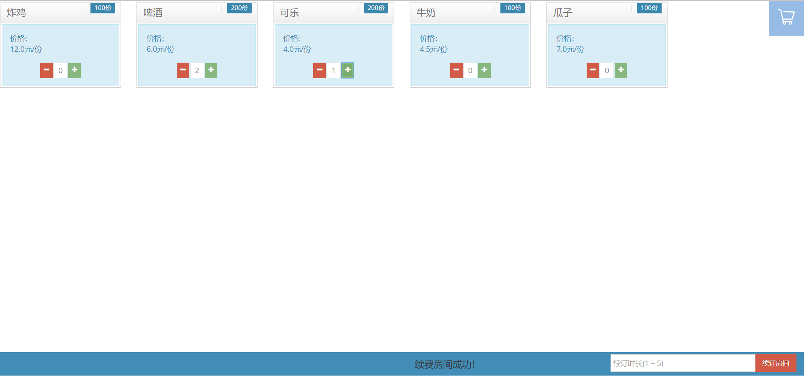

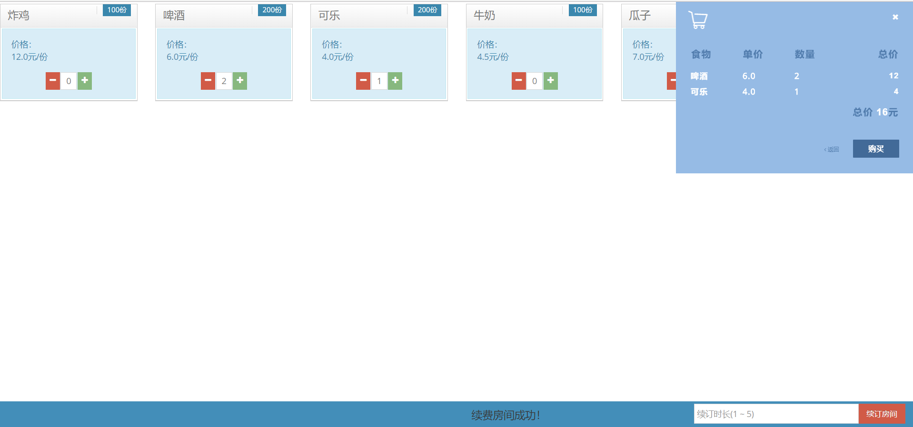

#### 5.2.3.2 续订房间
在用户界面下部输入续订房间的时间（1-5的整数），点击续订房间，完成续订

