# 软件设计文档

## 架构设计
本系统采用了MVC（Model-View-Controller）设计，模式，实现一个典型的三层架构模型。三层架构模型包括：模型层、视图层、控制器层。
- 视图层(View)

>视图层负责接收用户的命令，交给控制器层处理，并显示处理结果。我们采用SpringMVC负责视图层，并且调用控制器层提供的接口进行数据传递。
- 控制器层(Control)

>控制层是系统的核心组成部分。管理所有系统功能有关的数据流和控制流，从而实现系统的逻辑功能。向上提供服务接口给表示层调用。在控制器层中，不同的子系统提供独立的服务接口，各自独立实现，互不干预影响。控制器层依赖于持久化提供的持久化服务。
- 模型层(Model)

>模型层包括数据实体，并向上提供接口。属于不同子系统的数据实体放置在不同的包中。

下面给出系统的总体架构图，总体架构如上述，为典型的三层架构。

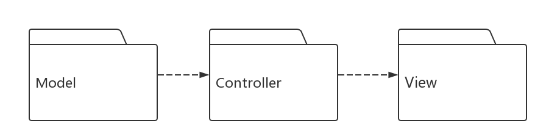

### KTV分析类机制

**表 - 分析类到分析机制的映射**

|分析类(analysis classes)|分析机制(analysis mechanism)|
|---|---|
|User           |持久化、安全性|
|UserImpl       |资源管理     |
|Food           |持久化、安全性|
|FoodImpl       |持久化、安全性|
|FoodService    |资源管理     |
|FoodServiceImpl|资源管理     |
|UserService    |图形化       |
|UserServiceImpl|持久化、安全性|
|Vip            |持久化、安全性|
|VipImpl        |持久化、安全性|
|VipService     |资源管理     |
|VipServiceImpl |资源管理     |
|Room           |持久化、安全性|
|RoomImpl       |持久化、安全性|
|RoomService    |资源管理     |

### KTV 的系统类图

在关键抽象的基础上，添加了个实体类的属性，形成图所示的系统类图。
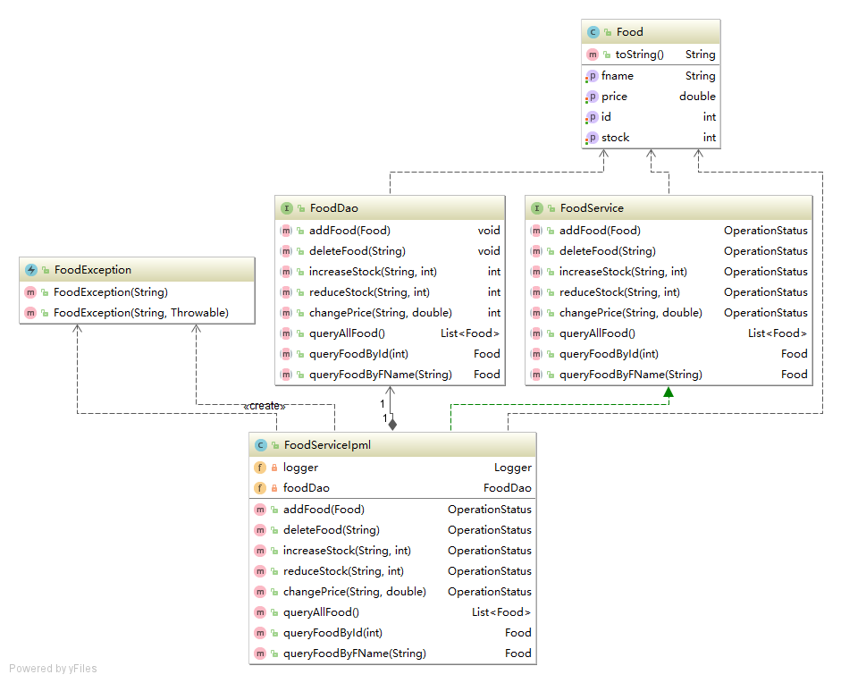
Food系统类图
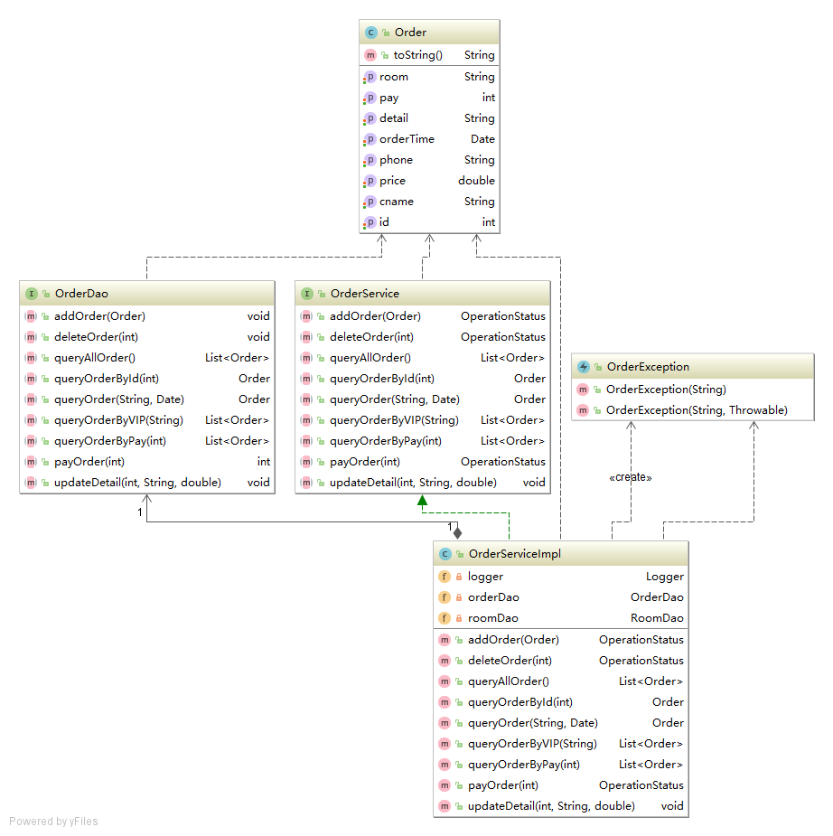
Order系统类图
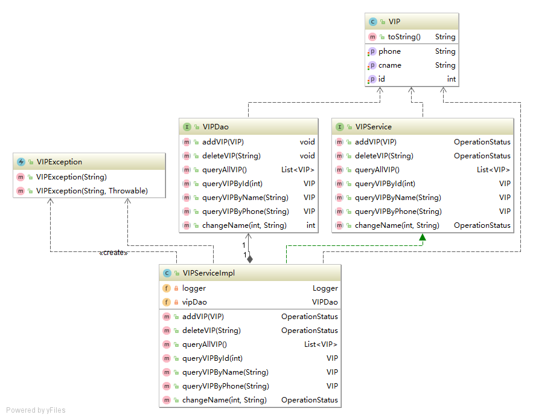
VIP系统类图 
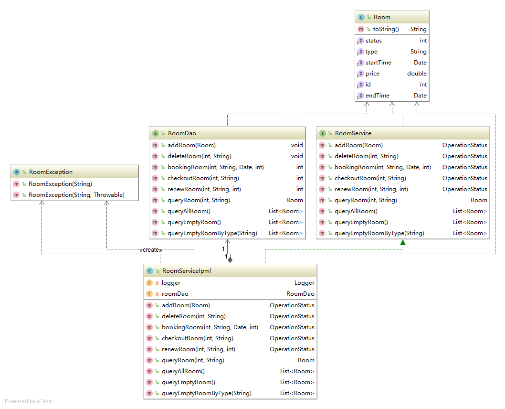
Room系统类图
						
## 子系统设计

### KTV系统的子系统及接口设计

KTV系统包括两个子系统：房间管理子系统和会员管理子系统。两个子系统向主程序提供接口服务，主程序调用子系统提供的接口完成主要的流程。
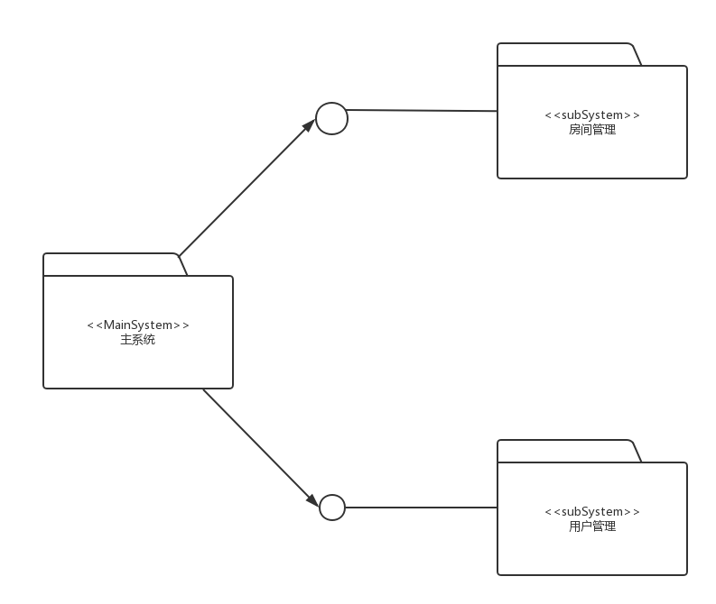

### KTV系统的子系统内部设计

#### 房间管理子系统设计

房间管理管理子系统遵循总体架构的分层策略，分别分为表示层，业务逻辑层与数据访问层，其中实体包独立于以上三层，包含了所有数据实体类的定义。

1. 表示层
由日记窗口和日历控件等组成。
2. 业务逻辑层
业务逻辑层负责提供完整的数据流控制服务，对每一个数据实体提供一个管理器类，管理器类负责处理数据的更改和转移，是整个系统的中枢。管理器向上层（表示层）提供调用接口，并调用下层的数据访问服务来完成持久化的操作。NoteManager 负责对日记进行逻辑处理，例如排序等操作，PropertyManager 负责对日记显示的样式等进行管理。
3. 数据访问层
数据访问层封装了数据库连接，读取，写入等操作，以提供数据库访问的服务。NoteAccessor 负责对日记进行存取等操作，PropertyAccessor 负责对日记显示的样式等进行存取。

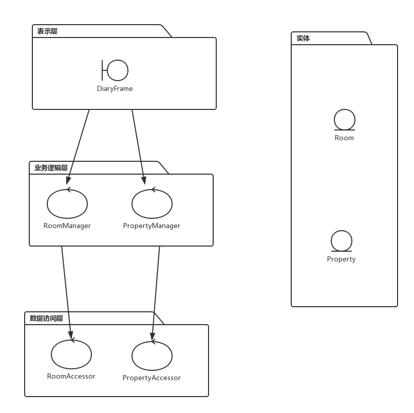

#### 用户管理子系统设计
根据系统总架构图，用户管理子系统也采用典型的三层架构模式：表示层，业务逻辑层，数据库访问层。
表示层以窗口界面的形式与用户交互，展示用户相关信息，主要有用户提醒，待办事项和记事便签三大界面。其中用户提醒除了提供用户信息一般的添加查看外，还会根据用户提醒设置，在预设的时间，以弹出窗口的形式向用户提示用户。
在与用户交互的过程中，表示层获取用户的相关信息后，以消息的形式传到业务逻辑层的控制器，控制器根据消息的类型，转发到相应的业务逻辑层处理类进行处理。处理完毕后，业务逻辑层处理类根据需要将处理后的消息进一步转发到数据访问层的相应类进行处理。
最后，通过数据访问层完成对信息的增删改持久化处理，以及对信息的查询等。
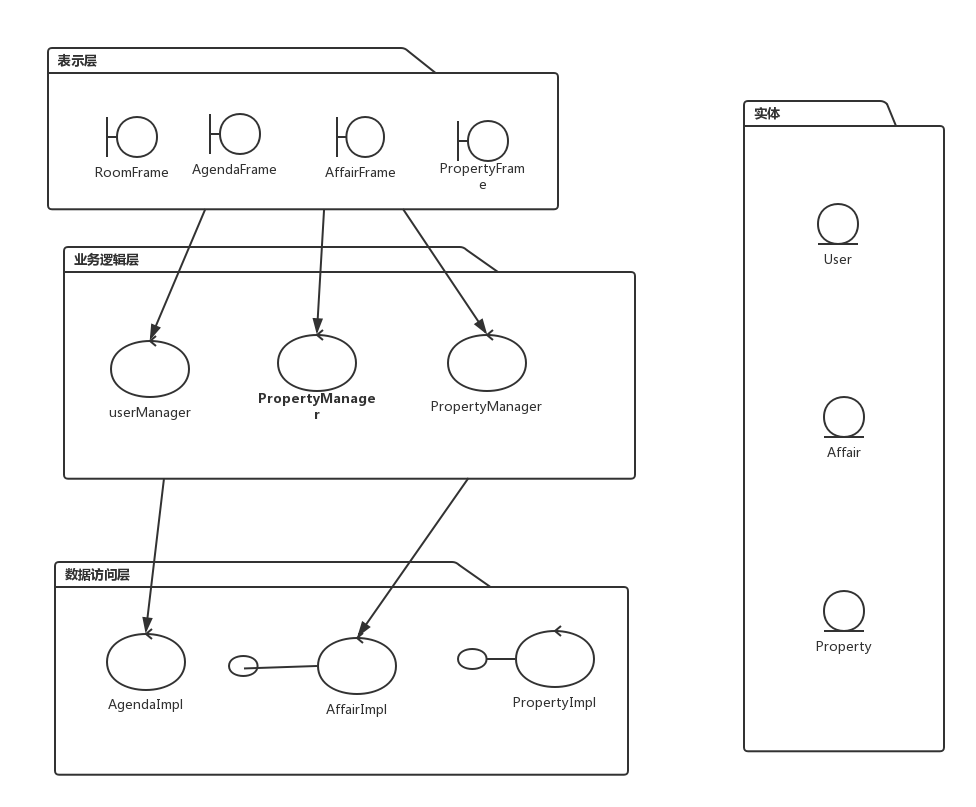

## KTV系统运行时架构设计

### KTV运行时进程分析

在系统设置模块中有三个功能：食品价格管理模块，房间管理模块和用户管理模块。系统在联网多用户的环境下使用，大部分操作都是单线程执行，点餐操作和结账功能需要使用多线程执行。如图 17 所示，系统包括 MainApplication 主进程，RoomApplication 房间管理进程，UserAppliacation 用户管理进程，OrderApplication 订单管理进程等以及提醒和库存不足提醒两个线程。
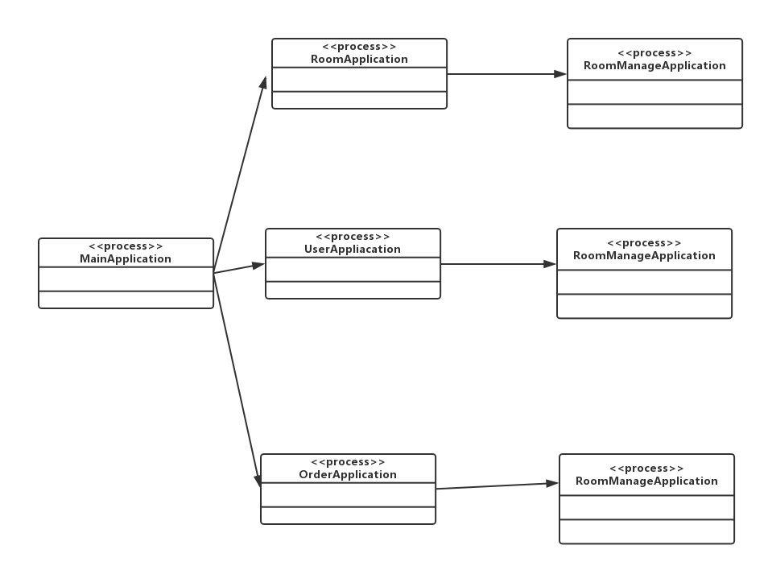

接下来将分两个模块，分别以一个详细的进程和实现关系图来说明该模块主要的运行时架构。用户管理模块和房间管理模块都涉及到多线程处理。

### KTV用户管理模块运行时架构设计

如下图所示，UserApplication进程对应于UserFrame边界类的实现，而RoomManagement对应于OrderManager的实现，最后RoomAccess对应于OrderAccesser的实现。由于该部分功能都只是单线程，单用户的环境下使用，并不存在并发等情况，所以运行时架构并不复杂，每个进程跟对应的实现类都是一对一的关系。

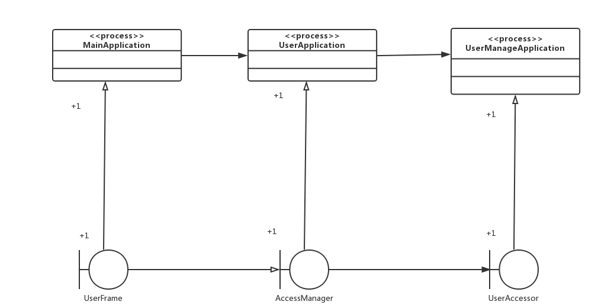

### KTV房间管理模块运行时架构设计

RoomManager线程管理多个Room对象，依赖于RoomManagement进程来获取Room对象。而RoomManagement进程对应于RoomBLImpl类的实现，RoomAccess对应于RooImpl类的实现。读取Agenda对象的过程只是单线程，单用户的环境下使用，并不存在并发等情况，所以每个进程跟对应的实现类都是一对一的关系。而RoomRemind线程将会在系统启动后，由MainApplication进程来创建，跟其他用户进程并发执行。RoomRemind运行期间，用户修改了Agenda，日程管理模块会及时通知RoomRemind进行更新。

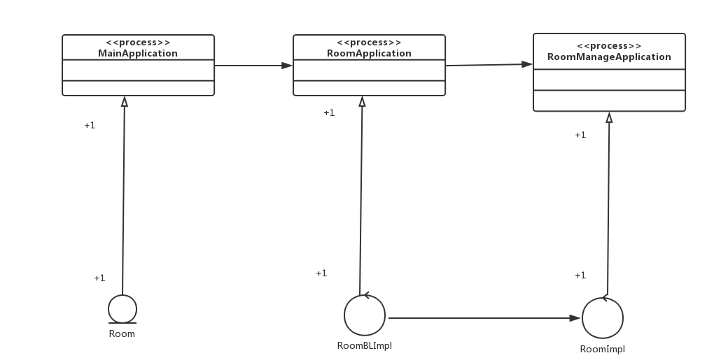

## KTV系统数据库设计

### KTV系统ER图的设计

以下给出由关键抽象的实体及其关联关系形成的 ER 图：

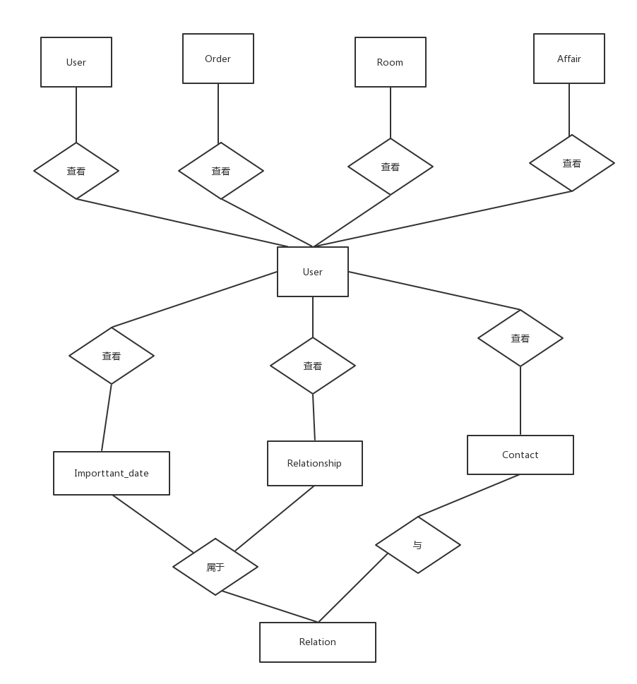

### KTV数据字典

#### 定义和缩写

|缩写|定义|
|---|---|
|P  |Primary key，主键|
|U  |Unique，唯一性约束或唯一性索引|
|F  |Foreign key，外键|
|I  |Index，索引|
|C  |Cluster，聚簇索引|

#### 数据表描述

|表名|描述|
|---|---|
|User           |用户表，包括帐号和登录密码|
|Note           |日记，包括正文，天气，心情等属性|
|Agenda         |日程表，记录日程信息|
|Affair         |事务表，记录待办事项的信息|
|Memo           |便条表，记录便签内容等信息|
|Contact        |通讯录表，通讯录的信息|
|Person         |联系人表，包括联系人的名称等基本属性|
|Relationship   |关系表，记录关系的类型，建立时间等|
|Relationship_log|关系日志，记录关系发展过程中的日志信息|
|Important_date |重要日期表，记录一些备忘的重要日期的信息|